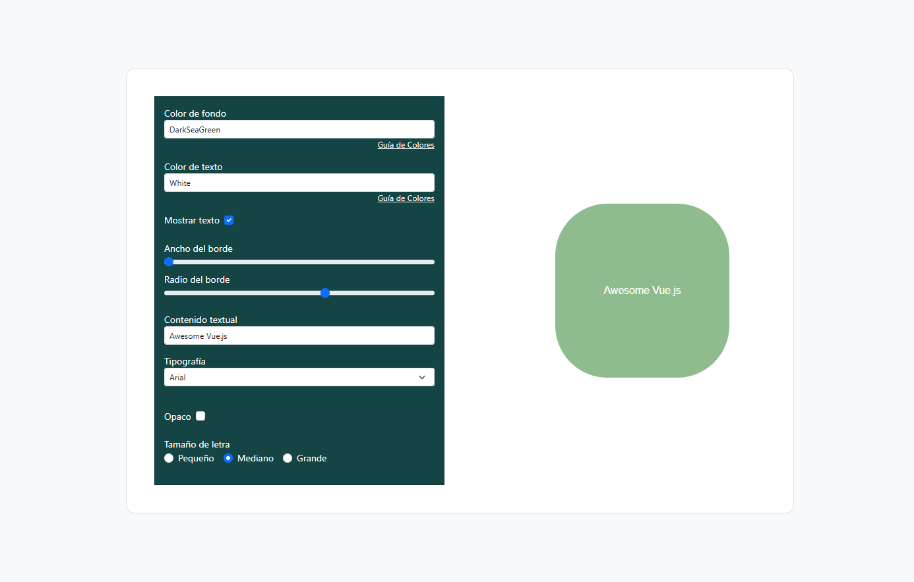

# **APPLICATION FOR DYNAMIC STYLE MANAGEMENT**

You can modify the figure on the right through the inputs in the form.

---

## **Technologies Used**
- **Vue.js**
- **Vite**
- **HTML5**
- **CSS3**
- **Bootstrap**

## **Features**
- **Dynamic Style Binding**: Uses the `:style` directive to dynamically assign styles to an element based on reactive state values.
- **Class Binding**: Allows conditional classes to be assigned reactively using the `:class` directive and boolean state values.
- **Dynamic Rendering**: Implements the `v-for` directive to iterate over an array and dynamically render multiple elements in the template.
- **Conditional Rendering**: Utilizes `v-show` or `v-if` to display or hide elements based on specific conditions.
- **Real-Time Interactivity**: Changes in the form inputs immediately affect the styles and classes of a figure on the screen.
- **Clean and Modular Code**: A structure designed to be easily extensible and organized.
- **User-Friendly Interface**: A simple interface that connects reactive logic with immediate visual changes.

## **Screenshots**
<p align="center">
  
</p>

## **Installation**
1. Start the project:
   ```bash
   npm run dev
